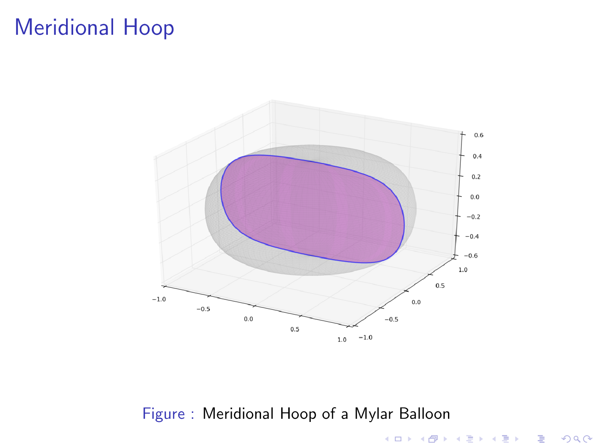

# A quick guide to small superpressure

A talk at
[UKHAS Conference 2016](https://ukhas.org.uk/general:ukhasconference2016)

_[Recording](https://www.youtube.com/watch?v=PQJAjDEq5AA&t=5h03m16s)_

_[Slides (PDF)](a-quick-guide.pdf)_

_[Ideal Gas Analysis (PDF)](ideal_gas_analysis.pdf)_

See also:

_[Prototype Calculator](https://richardeoin.github.io/sp/)_

<br\>

## Slides

